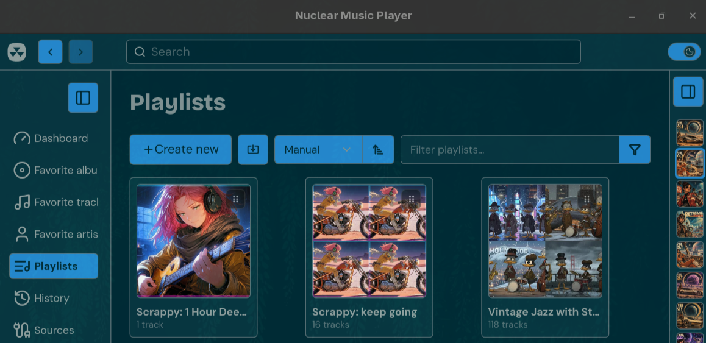

# nuclear-playlist-manual-sort

[](LICENSE)
[](https://nuclearplayer.com)

A high-performance extension for **Nuclear Music Player** that introduces a dedicated **Manual** playlist sorting option with drag-and-drop playlist card reorganization.



---

## Features

- **Dedicated "Manual" Sort Option**: Seamlessly integrates into Nuclear's native sort dropdown (`Name`, `Date added`, `Date modified`, `Track count`, `Duration`, **`Manual`**).
- **Click-and-Drag Reorganization**: Reorder playlists directly in the grid view by clicking and dragging cards.
- **Visual Feedback**:
  - Discreet 6-dot grip handle on playlist cards during manual mode.
  - Smooth card elevation and insertion highlight borders during drag operations.
  - `grab` / `grabbing` cursor state indicators.
- **Persistent Storage**: Saves your custom playlist arrangement using Nuclear's `api.Settings` API backed by local disk storage.
- **Accidental Navigation Guard**: Intelligent drag-release click suppression ensures that dropping a card never accidentally triggers navigation into the playlist.
- **Dynamic Reconciliation**: Automatically discovers new or imported playlists and appends them to your manual arrangement without clobbering existing custom orders.

---

## Directory Structure

```
nuclear-playlist-manual-sort/
├── package.json         # Plugin manifest and Nuclear metadata
├── index.js             # Core plugin engine & drag-and-drop controller
├── install.sh           # Local development & testing installer
├── LICENSE              # MIT License
└── README.md            # Documentation
```

---

## Installation (Local Development / Testing)

Run the automated installer script:

```bash
cd /home/chad/Work/nuclear-playlist-manual-sort
./install.sh
```

Restart Nuclear Music Player to load the plugin:

```bash
killall nuclear-music-player
nuclear-music-player &
```

---

## Verification & Usage

1. Open Nuclear Music Player.
2. Navigate to **Playlists** from the left sidebar navigation.
3. Open the sort dropdown in the top-right toolbar.
4. Select **Manual** (or notice it active by default).
5. Click and drag any playlist card to your preferred position.
6. The playlist cards will dynamically shift and persist your custom arrangement across restarts.

---

## Author

**Chad Longanecker**  
Security Automation & DevSecOps Engineer  
[GitHub Profile](https://github.com/HuggingBunny)

---

## License

This project is licensed under the MIT License - see the [LICENSE](LICENSE) file for details.
